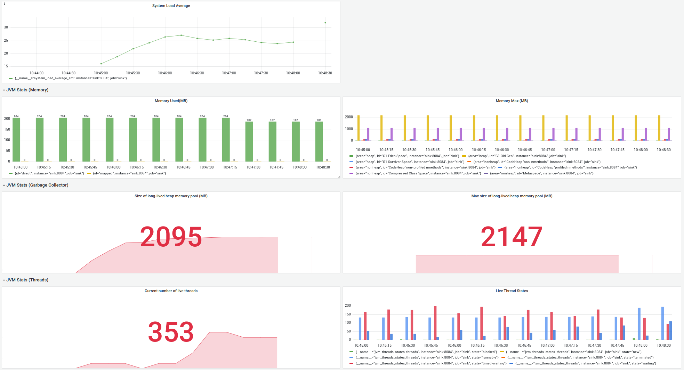

[](http://www.apache.org/licenses/LICENSE-2.0.html)
[](https://github.com/Altinity/clickhouse-sink-connector/actions/workflows/sink-connector-lightweight-integration-tests.yml)
[](https://github.com/Altinity/clickhouse-sink-connector/actions/workflows/unit_test_docker_image.yml)
<a href="https://join.slack.com/t/altinitydbworkspace/shared_invite/zt-w6mpotc1-fTz9oYp0VM719DNye9UvrQ">
  
</a>

Note: Two projects are combined in this repository.
1) #### Altinity Replicator for ClickHouse (Lightweight version) - Single Binary to replicate data from MySQL/PostgreSQL/MongoDB to ClickHouse.
   - Docker Image - `registry.gitlab.com/altinity-public/container-images/clickhouse_debezium_embedded:latest` , Java JAR file(Download from releases) 
   - `sink-connector-client` - Tool to check status of replication, start/stop replication.
   -  `Grafana dashboard` - sink-connector-lightweight/docker/config/grafana/config/
2) #### Altinity Sink Connector for ClickHouse   - Kafka Connect Sink connector - Requires Kafka, Debezium source connector and Schema Registry.
   - Docker Image, Java JAR file(Download from releases)

# #### Altinity Replicator for ClickHouse (Lightweight version)


New tool to replicate data from MySQL, PostgreSQL, MariaDB and Mongo without additional dependencies.
Single executable and lightweight.
##### Supports DDL in MySQL.

### Usage
##### From Command line.
Download the JAR file from the releases.
https://github.com/Altinity/clickhouse-sink-connector/releases
1.  Update **MySQL information** in config.yaml: `database.hostname`, `database.port`, `database.user` and `database.password`.
2.  Update **ClickHouse information** in config.yaml: `clickhouse.server.url`, `clickhouse.server.user`, `clickhouse.server.pass`, `clickhouse.server.port`. 
Also Update **ClickHouse information** for the following fields that are used to store the offset information- `offset.storage.jdbc.url`, `offset.storage.jdbc.user`, `offset.storage.jdbc.password`, `schema.history.internal.jdbc.url`, `schema.history.internal.jdbc.user`, and `schema.history.internal.jdbc.password`.
3.  Update MySQL databases to be replicated: `database.include.list`.
4.  Add table filters: `table.include.list`.
5.  Set `snapshot.mode` to `initial` if you like to replicate existing records, set `snapshot.mode` to `schema_only` to replicate schema and only the records that are modified after the connector is started.
6.  Start replication by running the JAR file. `java -jar clickhouse-debezium-embedded-1.0-SNAPSHOT.jar <yaml_config_file>` or docker.

### MySQL Configuration (docker/config.yaml)
```
database.hostname: "mysql-master"
database.port: "3306"
database.user: "root"
database.password: "root"
database.server.name: "ER54"
database.include.list: sbtest
#table.include.list=sbtest1
clickhouse.server.url: "clickhouse"
clickhouse.server.user: "root"
clickhouse.server.pass: "root"
clickhouse.server.port: "8123"
clickhouse.server.database: "test"
database.allowPublicKeyRetrieval: "true"
snapshot.mode: "schema_only"
offset.flush.interval.ms: 5000
connector.class: "io.debezium.connector.mysql.MySqlConnector"
offset.storage: "io.debezium.storage.jdbc.offset.JdbcOffsetBackingStore"
offset.storage.offset.storage.jdbc.offset.table.name: "altinity_sink_connector.replica_source_info"
offset.storage.jdbc.url: "jdbc:clickhouse://clickhouse:8123/altinity_sink_connector"
offset.storage.jdbc.user: "root"
offset.storage.jdbc.password: "root"
offset.storage.offset.storage.jdbc.offset.table.ddl: "CREATE TABLE if not exists %s
(
    `id` String,
    `offset_key` String,
    `offset_val` String,
    `record_insert_ts` DateTime,
    `record_insert_seq` UInt64,
    `_version` UInt64 MATERIALIZED toUnixTimestamp64Nano(now64(9))
)
ENGINE = ReplacingMergeTree(_version)
ORDER BY id
SETTINGS index_granularity = 8198"
offset.storage.offset.storage.jdbc.offset.table.delete: "delete from %s where 1=1"
schema.history.internal: "io.debezium.storage.jdbc.history.JdbcSchemaHistory"
schema.history.internal.jdbc.url: "jdbc:clickhouse://clickhouse:8123/altinity_sink_connector"
schema.history.internal.jdbc.user: "root"
schema.history.internal.jdbc.password: "root"
schema.history.internal.jdbc.schema.history.table.ddl: "CREATE TABLE if not exists %s
(`id` VARCHAR(36) NOT NULL, `history_data` VARCHAR(65000), `history_data_seq` INTEGER, `record_insert_ts` TIMESTAMP NOT NULL, `record_insert_seq` INTEGER NOT NULL) ENGINE=ReplacingMergeTree(record_insert_seq) order by id"

schema.history.internal.jdbc.schema.history.table.name: "altinity_sink_connector.replicate_schema_history"
enable.snapshot.ddl: "true"

```
### PostgreSQL Config(docker/config_postgres.yml)
```
database.hostname: "postgres"
database.port: "5432"
database.user: "root"
database.password: "root"
database.server.name: "ER54"
schema.include.list: public
plugin.name: "pgoutput"
table.include.list: "public.tm"
clickhouse.server.url: "clickhouse"
clickhouse.server.user: "root"
clickhouse.server.pass: "root"
clickhouse.server.port: "8123"
clickhouse.server.database: "test"
database.allowPublicKeyRetrieval: "true"
snapshot.mode: "initial"
offset.flush.interval.ms: 5000
connector.class: "io.debezium.connector.postgresql.PostgresConnector"
offset.storage: "io.debezium.storage.jdbc.offset.JdbcOffsetBackingStore"
offset.storage.offset.storage.jdbc.offset.table.name: "altinity_sink_connector.replica_source_info"
offset.storage.jdbc.url: "jdbc:clickhouse://clickhouse:8123/altinity_sink_connector"
offset.storage.jdbc.user: "root"
offset.storage.jdbc.password: "root"
offset.storage.offset.storage.jdbc.offset.table.ddl: "CREATE TABLE if not exists %s
(
    `id` String,
    `offset_key` String,
    `offset_val` String,
    `record_insert_ts` DateTime,
    `record_insert_seq` UInt64,
    `_version` UInt64 MATERIALIZED toUnixTimestamp64Nano(now64(9))
)
ENGINE = ReplacingMergeTree(_version)
ORDER BY id
SETTINGS index_granularity = 8198"
offset.storage.offset.storage.jdbc.offset.table.delete: "delete from %s where 1=1"
schema.history.internal: "io.debezium.storage.jdbc.history.JdbcSchemaHistory"
schema.history.internal.jdbc.url: "jdbc:clickhouse://clickhouse:8123/altinity_sink_connector"
schema.history.internal.jdbc.user: "root"
schema.history.internal.jdbc.password: "root"
schema.history.internal.jdbc.schema.history.table.ddl: "CREATE TABLE if not exists %s
(`id` VARCHAR(36) NOT NULL, `history_data` VARCHAR(65000), `history_data_seq` INTEGER, `record_insert_ts` TIMESTAMP NOT NULL, `record_insert_seq` INTEGER NOT NULL) ENGINE=ReplacingMergeTree(record_insert_seq) order by id"

schema.history.internal.jdbc.schema.history.table.name: "altinity_sink_connector.replicate_schema_history"
enable.snapshot.ddl: "true"
auto.create.tables: "true"
database.dbname: "public"
```

## Command Line(JAR)
https://github.com/Altinity/clickhouse-sink-connector/releases

`java -jar clickhouse-debezium-embedded-1.0-SNAPSHOT.jar <yaml_config_file>`

### Docker compose

`export SINK_LIGHTWEIGHT_VERSION=latest`

**MySQL**
```
cd sink-connector-lightweight/docker
docker-compose -f docker-compose-mysql.yml up
```
**MySQL (Connect to external MySQL and ClickHouse configuration)**
```
cd sink-connector-lightweight/docker
docker-compose -f docker-compose-mysql-standalone.yml up
```

**PostgreSQL**
```
cd sink-connector-lightweight/docker
docker-compose -f docker-compose-postgres.yml up
```
https://altinity.com/blog/replicating-data-from-postgresql-to-clickhouse-with-the-altinity-sink-connector

**PostgreSQL(Connect to external PostgreSQL and ClickHouse configuration)**
```
cd sink-connector-lightweight/docker
docker-compose -f docker-compose-postgres-standalone.yml up
```

##### Docker
Images are published in Gitlab.

`registry.gitlab.com/altinity-public/container-images/clickhouse_debezium_embedded:latest`

[Docker Setup instructions](sink-connector-lightweight/README.md)

##### CLI tool (To start/stop replication and set binlog status and gtid) - Start replication from a specific binlog position or gtid
Download the `sink-connector-client` from the latest releases.
```
 ./sink-connector-client 
NAME:
   Sink Connector Lightweight CLI - CLI for Sink Connector Lightweight, operations to get status, start/stop replication and set binlog/gtid position

USAGE:
   sink-connector-client [global options] command [command options] [arguments...]

VERSION:
   1.0

COMMANDS:
   start_replica        Start the replication
   stop_replica         Stop the replication
   show_replica_status  Status of replication
   update_binlog        Update binlog file/position and gtids
   help, h              Shows a list of commands or help for one command

GLOBAL OPTIONS:
   --host value   Host server address of sink connector
   --port value   Port of sink connector
   --secure       If true, then use https, else http
   --help, -h     show help
   --version, -v  print the version


```


#### Configuration
 Configuration                         | Description                                                                                                                                                                                                                                                                                                                                                                                                                                                                                                                          |
|---------------------------------------|--------------------------------------------------------------------------------------------------------------------------------------------------------------------------------------------------------------------------------------------------------------------------------------------------------------------------------------------------------------------------------------------------------------------------------------------------------------------------------------------------------------------------------------|
| database.hostname                     | Source Database HostName                                                                                                                                                                                                                                                                                                                                                                                                                                                                                                             |
| database.port                         | Source Database Port number                                                                                                                                                                                                                                                                                                                                                                                                                                                                                                          |
| database.user                         | Source Database Username(user needs to have replication permission, Refer https://debezium.io/documentation/reference/stable/connectors/mysql.html)                                                                                                          GRANT SELECT, RELOAD, SHOW DATABASES, REPLICATION SLAVE, REPLICATION CLIENT ON *.* TO 'user' IDENTIFIED BY 'password';                                                                                                                                                                                                                                                                      |
| database.password                     | Source Database Password                                                                                                                                                                                                                                                                                                                                                                                                                                                                                                             |
| database.include.list                 | List of databases to be included in replication.                                                                                                                                                                                                                                                                                                                                                                                                                                                                                     |
| table.include.list                    | List of tables to be included in replication.                                                                                                                                                                                                                                                                                                                                                                                                                                                                                        |
| clickhouse.server.url                 | ClickHouse URL, For TLS(use `https` and set port to `8443`)                                                                                                                                                                                                                                                                                                                                                                                                                                                                                                                      |
| clickhouse.server.user                | ClickHouse username                                                                                                                                                                                                                                                                                                                                                                                                                                                                                                                  |
| clickhouse.server.pass                | ClickHouse password                                                                                                                                                                                                                                                                                                                                                                                                                                                                                                                  |
| clickhouse.server.port                | ClickHouse port, For TLS(use the correct port `8443` or `443`                                                                                                                                                                                                                                                                                                                                                                                                                                                                                                                     |
| clickhouse.server.database            | ClickHouse destination database                                                                                                                                                                                                                                                                                                                                                                                                                                                                                                      |
| snapshot.mode                         | "initial" -> Data that already exists in source database will be replicated. "schema_only" -> Replicate data that is added/modified after the connector is started.\<br/> MySQL: https://debezium.io/documentation/reference/stable/connectors/mysql.html#mysql-property-snapshot-mode \ <br/>PostgreSQL: https://debezium.io/documentation/reference/stable/connectors/postgresql.html#postgresql-property-snapshot-mode  <br/> MongoDB: initial, never. https://debezium.io/documentation/reference/stable/connectors/mongodb.html |
| connector.class                       | MySQL -> "io.debezium.connector.mysql.MySqlConnector" <br/> PostgreSQL -> <br/> Mongo ->   <br/>                                                                                                                                                                                                                                                                                                                                                                                                                                     |
| offset.storage.file.filename          | Offset storage file(This stores the offsets of the source database) MySQL: mysql binlog file and position, gtid set. Make sure this file is durable and its not persisted in temp directories.                                                                                                                                                                                                                                                                                                                                       |
| database.history.file.filename        | Database History: Make sure this file is durable and its not persisted in temp directories.                                                                                                                                                                                                                                                                                                                                                                                                                                          |
| schema.history.internal.file.filename | Schema History: Make sure this file is durable and its not persisted in temp directories.                                                                                                                                                                                                                                                                                                                                                                                                                                            |
| disable.ddl                           | **Optional**, Default: false, if DDL execution needs to be disabled                                                                                                                                                                                                                                                                                                                                                                                                                                                                  |
| enable.ddl.snapshot                   | **Optional**, Default: false, If set to true, the DDL that is passed as part of snapshot process will be executed. Default behavior is DROP/TRUNCATE as part of snapshot is disabled.                                                                                                                                                                                                                                                                                                                                                |
| database.allowPublicKeyRetrieval      | **Optional**, MySQL specific: true/false                                                                                                                                                                                                                                                                                                                                                                                                                                                                                             |


# Altinity Sink Connector for ClickHouse

Sink connector is used to transfer data from Kafka to Clickhouse using the Kafka connect framework.
The connector is tested with the following converters
- JsonConverter
- AvroConverter (Using [Apicurio Schema Registry](https://www.apicur.io/registry/) or Confluent Schema Registry)


# Features
- Inserts, Updates and Deletes using ReplacingMergeTree - [Updates/Deletes](doc/mutable_data.md)
- Auto create tables in ClickHouse
- Exactly once semantics 
- Bulk insert to Clickhouse. 
- Store Kafka metadata [Kafka Metadata](doc/Kafka_metadata.md)
- Kafka topic to ClickHouse table mapping, use case where MySQL table can be mapped to a different CH table name.
- Store raw data in JSON(For Auditing purposes)
- Monitoring(Using Grafana/Prometheus) Dashboard to monitor lag.
- Kafka Offset management in ClickHouse
- Increased Parallelism(Customize thread pool for JDBC connections)

# Source Databases
- MySQL (Debezium)
  **Note:GTID Enabled - Highly encouraged for Updates/Deletes** 
  Refer enabling Gtid in Replica for non-GTID sources - https://www.percona.com/blog/useful-gtid-feature-for-migrating-to-mysql-gtid-replication-assign_gtids_to_anonymous_transactions/
- PostgreSQL (Debezium)

|  Component    |   Version(Tested) |
|---------------|-------------------|
| Redpanda      | 22.1.3, 22.3.9    |
| Kafka-connect | 1.9.5.Final       |
| Debezium      | 2.1.0.Alpha1      |
| MySQL         | 8.0               |
| ClickHouse    | 22.9, 22.10       |
| PostgreSQL    | 15                |


### Quick Start (Docker-compose)
Docker image for Sink connector (Updated December 12, 2022)
`altinity/clickhouse-sink-connector:latest`
https://hub.docker.com/r/altinity/clickhouse-sink-connector

### Recommended Memory limits.
**Production Usage**
In `docker-compose.yml` file, its recommended to set Xmx to atleast 5G `-Xmx5G` when using in Production and 
if you encounter a `Out of memory/Heap exception` error. 
for both **Debezium** and **Sink**

```
- KAFKA_HEAP_OPTS=-Xms2G -Xmx5G
```


### Kubernetes
Docker Image for Sink connector(with Strimzi)
https://hub.docker.com/repository/docker/subkanthi/clickhouse-kafka-sink-connector-strimzi

Docker Image for Debezium MySQL connector(with Strimzi)
https://hub.docker.com/repository/docker/subkanthi/debezium-mysql-source-connector


Recommended to atleast set 5Gi as memory limits to run on kubernetes using strimzi.

```   resources:
      limits:
        memory: 6Gi
      requests:
        memory: 6Gi

```
#### MySQL:
```bash
cd deploy/docker
./start-docker-compose.sh 
```
#### PostgreSQL:
```
export SINK_VERSION=latest
cd deploy/docker
docker-compose -f docker-compose.yaml -f docker-compose-postgresql.override.yaml up
```

For Detailed setup instructions - [Setup](doc/setup.md)

## Development:
Requirements
- Java JDK 11 (https://openjdk.java.net/projects/jdk/11/)
- Maven (mvn) (https://maven.apache.org/download.cgi)
- Docker and Docker-compose
```
mvn install -DskipTests=true
```

## Data Types
#### Note: Using float data types are highly discouraged, because of the behaviour in ClickHouse with handing precision.(Decimal is a better choice)

| MySQL              | Kafka<br>Connect                                     | ClickHouse                      |
|--------------------|------------------------------------------------------|---------------------------------|
| Bigint             | INT64\_SCHEMA                                        | Int64                           |
| Bigint Unsigned    | INT64\_SCHEMA                                        | UInt64                          |
| Blob               |                                                      | String + hex                    |
| Char               | String                                               | String / LowCardinality(String) |
| Date               | Schema: INT64<br>Name:<br>debezium.Date              | Date(6)                         |
| DateTime(6)        | Schema: INT64<br>Name: debezium.Timestamp            | DateTime64(6)                   |
| Decimal(30,12)     | Schema: Bytes<br>Name:<br>kafka.connect.data.Decimal | Decimal(30,12)                  |
| Double             |                                                      | Float64                         |
| Int                | INT32                                                | Int32                           |
| Int Unsigned       | INT64                                                | UInt32                          |
| Longblob           |                                                      | String + hex                    |
| Mediumblob         |                                                      | String + hex                    |
| Mediumint          | INT32                                                | Int32                           |
| Mediumint Unsigned | INT32                                                | UInt32                          |
| Smallint           | INT16                                                | Int16                           |
| Smallint Unsigned  | INT32                                                | UInt16                          |
| Text               | String                                               | String                          |
| Time               |                                                      | String                          |
| Time(6)            |                                                      | String                          |
| Timestamp          |                                                      | DateTime64                      |
| Tinyint            | INT16                                                | Int8                            |
| Tinyint Unsigned   | INT16                                                | UInt8                           |
| varbinary(\*)      |                                                      | String + hex                    |
| varchar(\*)        |                                                      | String                          |
| JSON               |                                                      | String                          |
| BYTES              | BYTES, io.debezium.bits                              | String                          |
| YEAR               | INT32                                                | INT32                           |
| GEOMETRY           | Binary of WKB                                        | String                          |

### Sink Connector Configuration
|  Property                        |   Default | Description                                                                                                                                                           |
|----------------------------------|-----------|-----------------------------------------------------------------------------------------------------------------------------------------------------------------------|
| tasks.max                        | No        | SinkConnector task(essentially threads), ideally this needs to be the same as the Kafka partitions.                                                                   |
| topics.regex                     | No        | Regex of matching topics.  Example: "SERVER5432.test.(.*)" matches SERVER5432.test.employees and SERVER5432.test.products                                             |
| topics                           | No        | The list of topics. topics or topics.regex has to be provided.                                                                                                        |
| clickhouse.server.url            |           | ClickHouse Server URL                                                                                                                                                 |
| clickhouse.server.user           |           | ClickHouse Server username                                                                                                                                            |
| clickhouse.server.pass           |           | ClickHouse Server password                                                                                                                                            |
| clickhouse.server.database       |           | ClickHouse Database name                                                                                                                                              |
| clickhouse.server.port           | 8123      | ClickHouse Server port                                                                                                                                                |
| clickhouse.topic2table.map       | No        | Map of Kafka topics to table names, <topic_name1>:<table_name1>,<topic_name2>:<table_name2> This variable will override the default mapping of topics to table names. |
| store.kafka.metadata             | false     | If set to true, kafka metadata columns will be added to Clickhouse                                                                                                    |
| store.raw.data                   | false     | If set to true, the entire row is converted to JSON and stored in the column defined by the  ` store.raw.data.column ` field                                          |
| store.raw.data.column            | No        | Clickhouse table column to store the raw data in JSON form(String Clickhouse DataType)                                                                                |
| metrics.enable                   | true      | Enable Prometheus scraping                                                                                                                                            |
| metrics.port                     | 8084      | Metrics port                                                                                                                                                          |
| buffer.flush.time.ms             | 30        | Buffer(Batch of records) flush time in milliseconds                                                                                                                   |
| thread.pool.size                 | 10        | Number of threads that is used to connect to ClickHouse                                                                                                               |
| auto.create.tables               | false     | Sink connector will create tables in ClickHouse (If it does not exist)                                                                                                |
| snowflake.id                     | true      | Uses SnowFlake ID(Timestamp + GTID) as the version column for ReplacingMergeTree                                                                                      |
| replacingmergetree.delete.column | "sign"    | Column used as the sign column for ReplacingMergeTree.

## ClickHouse Loader(Load Data from MySQL to CH for Initial Load)
[Clickhouse Loader](python/README.md) is a program that loads data dumped in MySQL into a CH database compatible the sink connector (ReplacingMergeTree with virtual columns _version and _sign)


### Grafana Dashboard





## Documentation
- [Architecture](doc/architecture.md)
- [Local Setup - Docker Compose](doc/setup.md)
- [Debezium Setup](doc/debezium_setup.md)
- [Kubernetes Setup](doc/k8s_pipeline_setup.md)
- [Sink Configuration](doc/sink_configuration.md)
- [Testing](doc/TESTING.md)
- [Performance Benchmarking](doc/Performance.md)
- [Confluent Schema Registry(REST API)](doc/schema_registry.md)

## Blog articles
- [ClickHouse as an analytic extension for MySQL](https://altinity.com/blog/using-clickhouse-as-an-analytic-extension-for-mysql?utm_campaign=Brand&utm_content=224583767&utm_medium=social&utm_source=linkedin&hss_channel=lcp-10955938)
- [Altinity Sink connector for ClickHouse](https://altinity.com/blog/fast-mysql-to-clickhouse-replication-announcing-the-altinity-sink-connector-for-clickhouse)
- [Replicating PostgreSQL to ClickHouse](https://altinity.com/blog/replicating-data-from-postgresql-to-clickhouse-with-the-altinity-sink-connector)
